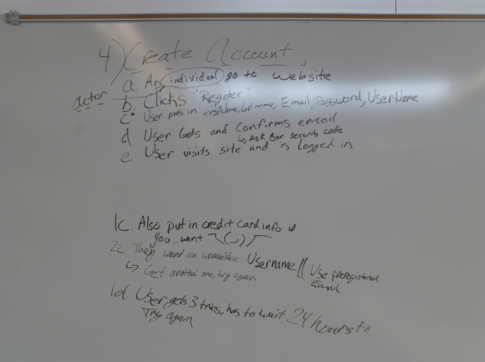
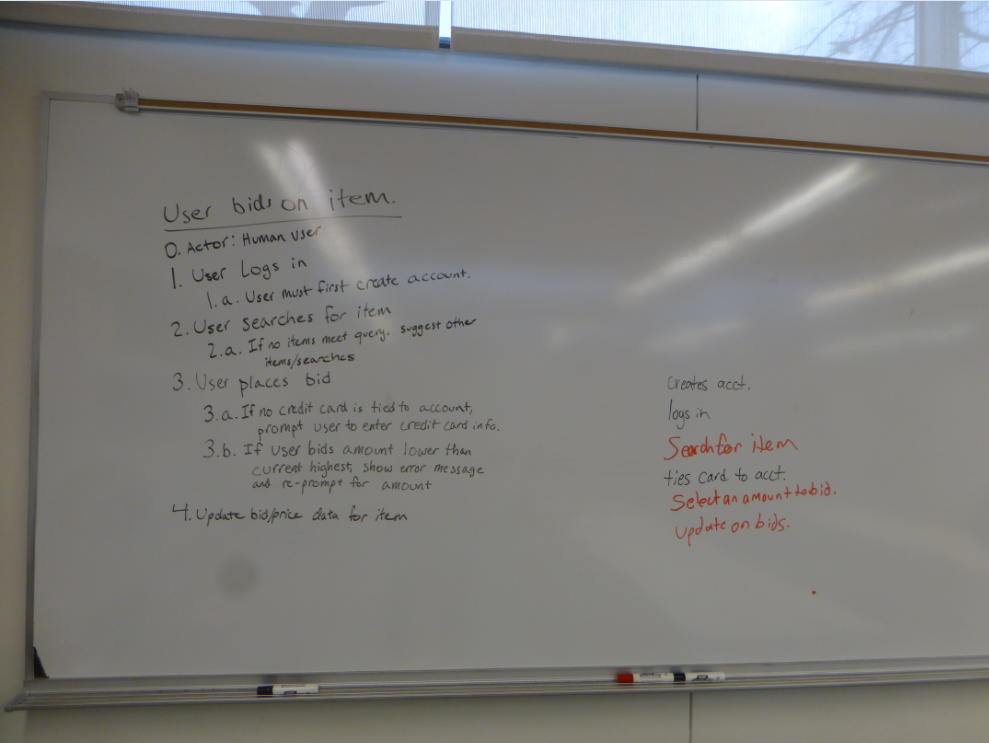

This page links to the results of in-class activities.

**Section 101 Use Cases: Friday, Feb 5th:**

**Section 102 Use Cases: Friday, Feb 5th:**

**Section 103 Use Cases: Friday, Feb 5th:**

**Examples from CS320 Spring 2015 Activities**

[Online auction Use cases, Spring 2015](https://www.flickr.com/photos/129359763@N05/sets/72157648317033113/)

[Online auction analysis models, Spring 2015](https://www.flickr.com/photos/129359763@N05/sets/72157650719158531/)

[Team project problem domain analysis, Spring 2015](https://www.flickr.com/photos/129359763@N05/sets/72157650314419210/)
