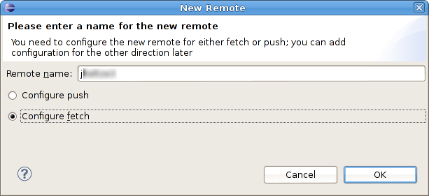
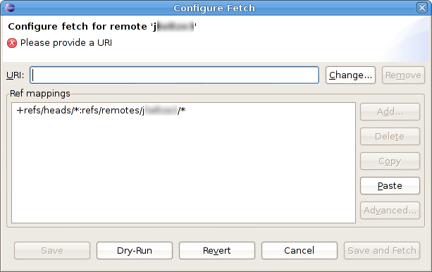
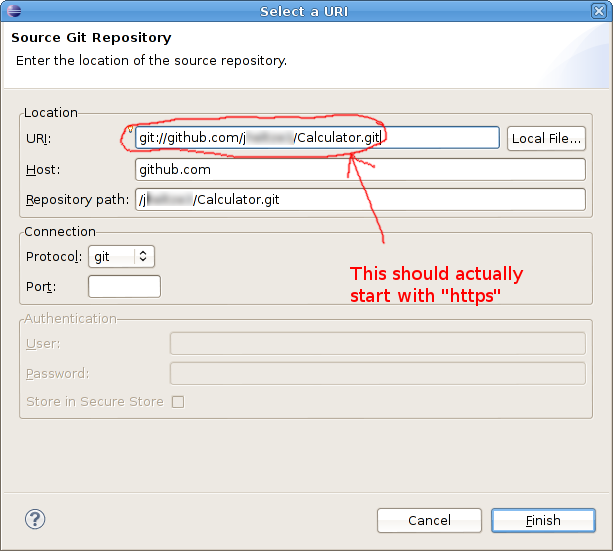
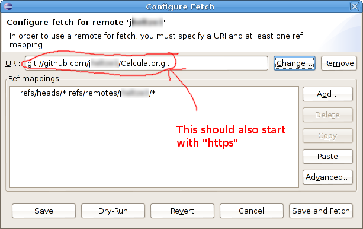
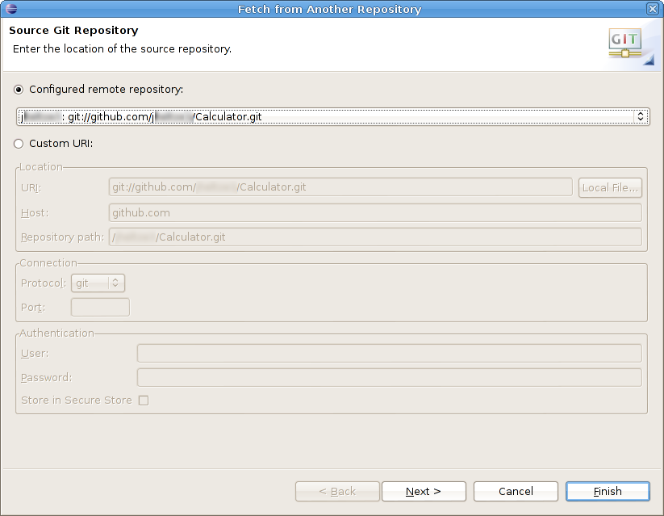
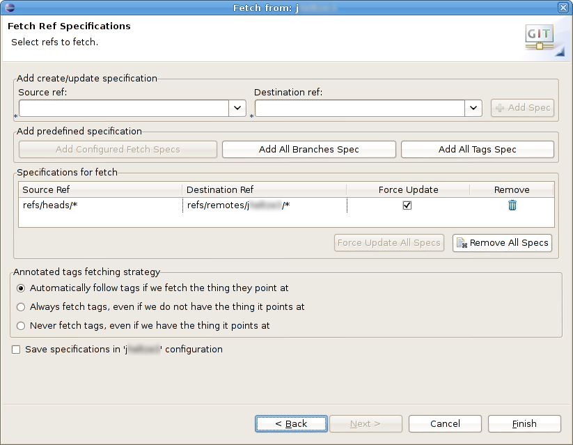
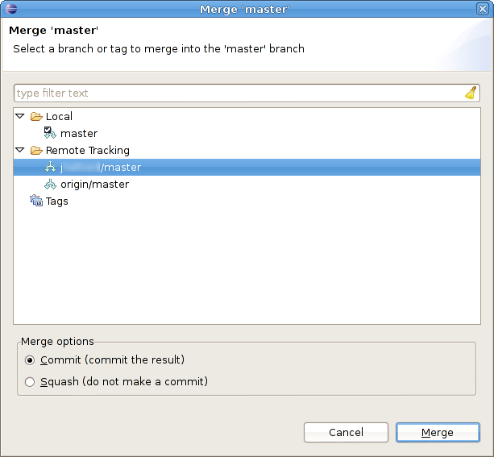

Fetching/Merging changes within Eclipse
=======================================

As you work on your team project, you will periodically want to incorporate changes made by your team members into your own repository. This page explains how to do this from within Eclipse.

Configuring a remote repository and tracking branch(es)
-------------------------------------------------------

A *remote repository* is a repository that you access over a network. In the usual distributed git workflow, each team member will have his or her own public repository (for example, on [github](https://github.com/)). From the standpoint of your private (development) repository, these are all remote repositories.

Your own public repository is special: it is the *origin* repository for your private repository. The origin repository is the default destination for push operations and source for pull operations. You can push changes to and pull changes from your origin using the **Team** → **Push to upstream** and **Team** → **Pull** commands, respectively.

As your team members make changes and push them to their public repositories, you will want to incorporate their changes into your own private development repository. To do this you need to add your team members' public repositories as *remotes*. A remote is simply a remote repository that you tell git that you want it to remember. You will probably want to create a remote for each of your team members' public repositories.

A *tracking branch* is a branch in your private repository that is dedicated to keeping track of changes made within a remote repository. When you fetch changes from a remote (e.g., a team member's public repository), those changes will be added automatically to a tracking branch.

Adding changes to a tracking branch does not modify any of your local files. To incorporate changes on a tracking branch into your own files, you perform a *merge* operation. Note that a merge can result in conflicts if you have edited the same regions of files that were modified by the changes on the tracking branch you are merging.

Enough theory...let's see how to fetch and merge
================================================

Here is how to get changes from a team member.

Configure a remote
------------------

First, if you have not already done so, you will need to add your team member's public repository as a remote. From the **Window** menu, choose **Open Perspective** → **Other** → **Git Repository Exploring**. In the "Git Repositories" view, expand the item for your repository, and then expand the **Remotes** item. Right-click on **Remotes** and choose **Create Remote**. For the remote name, use the username of your team member. Make sure **Configure fetch** is selected (*not* "Configure push"). The dialog should look something like this:

> 

Click **OK**. This will take you to the "Configure Fetch" dialog:

> 

In the "Configure Fetch" dialog, click the **Change...** button. Copy the "HTTPS" URI of your team member's public repository, and paste it into the URI field. The dialog should look something like this:

> 

Click **Finish**. The "Configure Fetch" dialog should now look something like this:

> 

Now click **Save**. You should now see the remote you created under the **Remotes** item.

Return to the Java perspective using **Window** → **Open Perspective** → **Other** → **Java**.

Fetching changes
----------------

To fetch changes, right click on the project and choose **Team** → **Remote** → **Fetch from...**. Select "Configured remote repository", and choose the remote corresponding to the team member you want to fetch changes from. (I.e., the one you configured using the instructions in the previous section.) The dialog should look something like this:

> 

Click **Next**. You should now see a dialog looking something like the following:

> 

Now click **Finish**. Eclipse will fetch all of the most recent from the remote repository and add them to the remote tracking branch in your private repository. Note that this does *not* change any of your local files.

Merging changes
---------------

Once you have fetched changes from a remote, you can merge them by right-clicking on the project and choosing **Team** → **Merge**. Under the "Remote Tracking" item, choose the remote tracking branch corresponding to the team member you fetched changes from. The dialog should look something like this:

> 

Click **Merge**. The "Merge Result" dialog will show you which changes were applied by the merge, and will report whether or not there were any merge conflicts.

If there were merge conflicts, you will need to resolve them by editing the affected files, then marking each by right-clicking on the file and choosing **Team** → **Add to index**. Once you have resolved the conflicts in each file, you should be able to commit.

After successfully merging someone else's changes, you should push to your public repository. This will make the changes you fetched and merged part of your version of the project.
